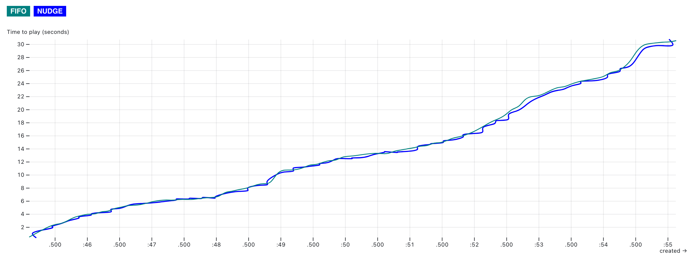
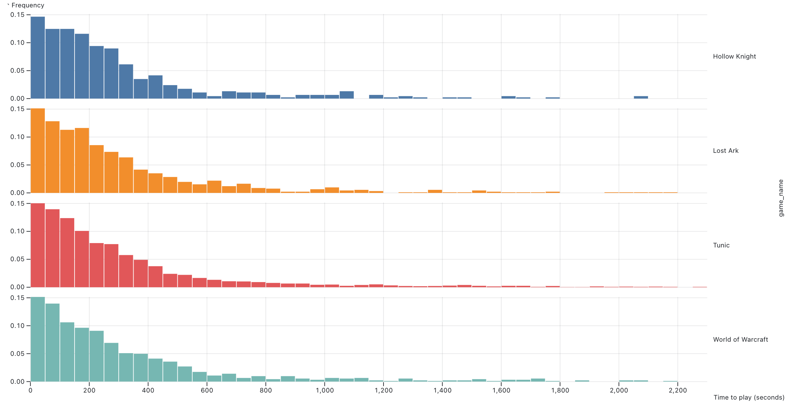
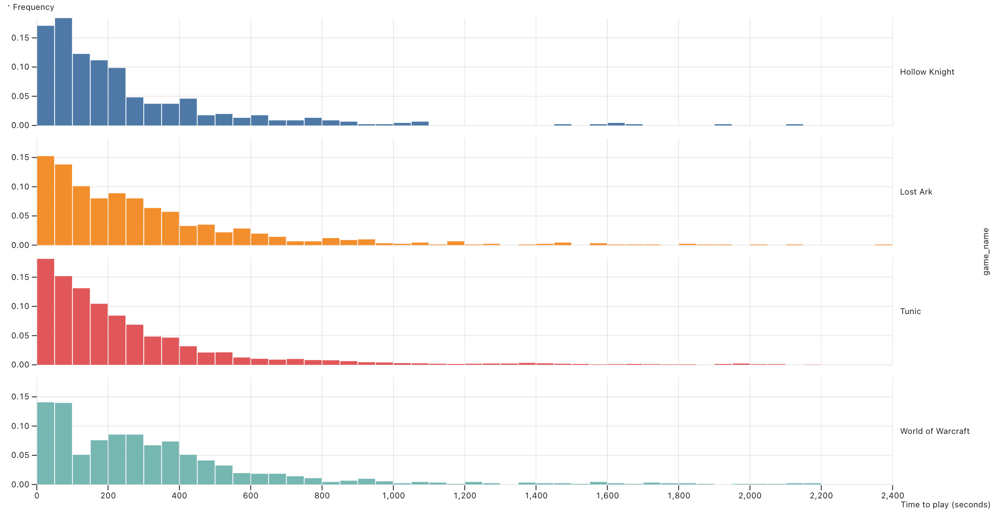

# Improving Queueing: Simulating FIFO vs Nudge.

#### Making gamers happier, one nudge at a time.

This repo generates simulated data in order to compare the effects that [Nudge](https://arxiv.org/abs/2106.01492) has
when scheduling work that has a light-tail distribution, with known run times
for the tasks.

## Intro

Nudge is a scheduling policy. In the context of Queueing theory, the policy impacts the performance of
a scheduling algorithm. "First Come, First Served" or FIFO is simple to understand and implement.
It's also fair. It's one of the most popular algorithms in practice.

Nudge is a simple optimization on top of FIFO, and it's very intuitive. In a few words, when a small
job arrives to the queue, the scheduler checks for the job immediately ahead of it. If that job is bigger
then we swap their position in the queue, and prioritize the smaller job. And there's a limit, a bigger
job can only be "jumped" once.

Here's a nice [video introduction](https://www.youtube.com/watch?v=G3NWAOlHpoI) and
here's the [full paper](https://dl.acm.org/doi/abs/10.1145/3410220.3460102),
and [proof](https://dl.acm.org/doi/abs/10.1145/3570610)
that even with weaker conditions still make it better than FIFO for light-tailed job distributions.

## How to Run

1. Install all dependencies

```shell
$ npm i
```

2. Run the simulation

```shell
$ TOTAL_RUNS=10 DONT_SAVE=true npm run nudge
```

#### Summary
There's a summary at the end, it shows the average for FIFO and Nudge, broken down
per game, with best and worst time and the average time in queue.

These values are expected to be very close for both runs, with larger runs the numbers should start to change
but there shouldn't be a huge difference between them.

Example:

```shell
[12:11:45.499] INFO (Queue Nudging): =========================SimpleFIFOStore==============================
[12:11:45.499] INFO (Queue Nudging): ======= Tunic (265) =======
[12:11:45.501] INFO (Queue Nudging): Average time in queue: 1 second, 753 milliseconds
[12:11:45.501] INFO (Queue Nudging): Best time 1 second, 749 milliseconds for Tunic (483) size: 2GB -> download: 250 milliseconds -> install: 1 second, 499 milliseconds
[12:11:45.503] INFO (Queue Nudging): Worst time: 1 second, 767 milliseconds for Tunic (288) size: 2GB -> download: 255 milliseconds -> install: 1 second, 512 milliseconds
[12:11:45.503] INFO (Queue Nudging): ======= Lost Ark (82) =======
[12:11:45.504] INFO (Queue Nudging): Average time in queue: 6 seconds, 553 milliseconds
[12:11:45.504] INFO (Queue Nudging): Best time 6 seconds, 550 milliseconds for Lost Ark (93) size: 10GB -> download: 1 second, 50 milliseconds -> install: 5 seconds, 500 milliseconds
[12:11:45.504] INFO (Queue Nudging): Worst time: 6 seconds, 576 milliseconds for Lost Ark (451) size: 10GB -> download: 1 second, 60 milliseconds -> install: 5 seconds, 516 milliseconds
[12:11:45.504] INFO (Queue Nudging): ======= Hollow Knight (52) =======
[12:11:45.504] INFO (Queue Nudging): Average time in queue: 1 second, 752 milliseconds
[12:11:45.504] INFO (Queue Nudging): Best time 1 second, 749 milliseconds for Hollow Knight (290) size: 2GB -> download: 250 milliseconds -> install: 1 second, 499 milliseconds
[12:11:45.504] INFO (Queue Nudging): Worst time: 1 second, 761 milliseconds for Hollow Knight (38) size: 2GB -> download: 253 milliseconds -> install: 1 second, 508 milliseconds
[12:11:45.504] INFO (Queue Nudging): ======= World of Warcraft (101) =======
[12:11:45.504] INFO (Queue Nudging): Average time in queue: 30 seconds, 552 milliseconds
[12:11:45.504] INFO (Queue Nudging): Best time 30 seconds, 549 milliseconds for World of Warcraft (374) size: 50GB -> download: 5 seconds, 49 milliseconds -> install: 25 seconds, 500 milliseconds
[12:11:45.504] INFO (Queue Nudging): Worst time: 30 seconds, 571 milliseconds for World of Warcraft (276) size: 50GB -> download: 5 seconds, 69 milliseconds -> install: 25 seconds, 502 milliseconds
[12:11:45.504] INFO (Queue Nudging): =========================SimpleNudgingStore==============================
[12:11:45.504] INFO (Queue Nudging): Nudged: 122
[12:11:45.504] INFO (Queue Nudging): ======= Tunic (265) =======
[12:11:45.504] INFO (Queue Nudging): Average time in queue: 1 second, 753 milliseconds
[12:11:45.504] INFO (Queue Nudging): Best time 1 second, 750 milliseconds for Tunic (57) size: 2GB -> download: 250 milliseconds -> install: 1 second, 500 milliseconds
[12:11:45.505] INFO (Queue Nudging): Worst time: 1 second, 762 milliseconds for Tunic (123) size: 2GB -> download: 262 milliseconds -> install: 1 second, 500 milliseconds
[12:11:45.505] INFO (Queue Nudging): ======= Lost Ark (82) =======
[12:11:45.505] INFO (Queue Nudging): Average time in queue: 6 seconds, 553 milliseconds
[12:11:45.505] INFO (Queue Nudging): Best time 6 seconds, 549 milliseconds for Lost Ark (202) size: 10GB -> download: 1 second, 50 milliseconds -> install: 5 seconds, 499 milliseconds
[12:11:45.505] INFO (Queue Nudging): Worst time: 6 seconds, 566 milliseconds for Lost Ark (260) size: 10GB -> download: 1 second, 66 milliseconds -> install: 5 seconds, 500 milliseconds
[12:11:45.505] INFO (Queue Nudging): ======= Hollow Knight (52) =======
[12:11:45.505] INFO (Queue Nudging): Average time in queue: 1 second, 752 milliseconds
[12:11:45.505] INFO (Queue Nudging): Best time 1 second, 750 milliseconds for Hollow Knight (135) size: 2GB -> download: 250 milliseconds -> install: 1 second, 500 milliseconds
[12:11:45.505] INFO (Queue Nudging): Worst time: 1 second, 758 milliseconds for Hollow Knight (237) size: 2GB -> download: 254 milliseconds -> install: 1 second, 504 milliseconds
[12:11:45.505] INFO (Queue Nudging): ======= World of Warcraft (101) =======
[12:11:45.505] INFO (Queue Nudging): Average time in queue: 30 seconds, 552 milliseconds
[12:11:45.505] INFO (Queue Nudging): Best time 30 seconds, 550 milliseconds for World of Warcraft (71) size: 50GB -> download: 5 seconds, 51 milliseconds -> install: 25 seconds, 499 milliseconds
[12:11:45.505] INFO (Queue Nudging): Worst time: 30 seconds, 565 milliseconds for World of Warcraft (205) size: 50GB -> download: 5 seconds, 52 milliseconds -> install: 25 seconds, 513 milliseconds
[12:11:45.505] INFO (Queue Nudging): Game Distribution ->
    games: {
      "Tunic": 265,
      "Lost Ark": 82,
      "Hollow Knight": 52,
      "World of Warcraft": 101
    }
[12:11:45.520] INFO (Queue Nudging): Done in 1 minute, 37 seconds, 651 milliseconds!

```

### Results

Even when the results don't clearly suggest that there's been an improvement, plotting the data does
show an improvement:



Nudge is under FIFO most of the time. If we zoom into the distributions for both it's easier to see
that the tail is "lighter" with nudge, and the time to play it's better for all games:

#### FIFO


#### Nudge



Nudge has shorter time to play for all the games, lighter tails, and the frequency of
longer time to play is less pronounced that first-come first-served while still
being relatively fair.

## Simulation Model

In this simulation, we use four games Tunic, Hollow Knight, Lost Ark and World of Warcraft
to model traffic with imaginary values.

The activity uses a probabilistic distribution (see ProbabilisticGameActivityFactory), where
Tunic is the game that's played the most, then WoW and Lost Ark, and Hollow Knight the least.

The size on disk of the game is used as a proxy metric to the time it'll take to finish
the activity (running the game). Small games are 2GB, Medium games are 10GB and Big
games are 50GB.

### Games

- Tunic, small size and popular.
- Hollow Knight, small size but not so popular.
- Lost Ark, medium and somewhat popular.
- World of Warcraft, big and just as popular as Lost Ark.

A typical distribution might look like this (1000 iterations):

 ```
Game Distribution -> {
    "Tunic": 556,
    "World of Warcraft": 186,
    "Lost Ark": 168,
    "Hollow Knight": 90
}
```

### Game Runners

We are measuring the hypothetical time it'll take us to get the game running, so we can play.

For the purpose of the simulation I'm keeping it simple, so it's easier to compare FIFO vs Nudge.

For now it just means

- Downloading the game. It takes 10ms per GB, with jitter and 5ms.
- Installing the game. It takes 50ms per GB, with jitter and 50ms.

Once that's done, we say it's running, and it's time to play!

There's a "just get me data" mode, where the runner doesn't actually wait and just
calculates the time it'd take if this ran. Very useful when debugging.

### Game Activity and Run Metadata

The activity keeps metadata about the run:

- When the activity was launched, think of it when someone decided they wanted to play the game. In the future we can
  model it from something like: [Hollow Knight - SteamCharts](https://steamcharts.com/app/367520).
- The time it took to find a runner for the game.
- Time it took to run (download and install).
- If we nudged the activity.

### Factories

There's two factories to launch activities:

- **ProbabilisticGameActivityFactory**: Uses a Probabilistic generation based on the
  distribution values set in "weights".
- **RandomGameActivityFactory.ts**: Just randomly picks a game.

They both use the **GameList** on **GamesConfig** to pick the games.


